# EPAM AI/Run™ for AWS Migration and Modernization Deployment Guide

[](https://opensource.org/licenses/Apache-2.0)

# Introduction

**EPAM AI/Run™ for AWS Migration and Modernization** is an event-driven, cloud-native SDLC and cloud modernization methodology powered by an integrated
agentic AI automation platform. Delivered as an AWS-native package, it provides seamless third-party integrations with
leading industry solutions, along with proprietary advanced code modernization capabilities. The platform accelerates
workflows, simplifies project onboarding, and enhances productivity across diverse SDLC roles through smart assistance
and full automation. With tailored solutions for migrating legacy systems, databases, and virtual machines to AWS
environments, EPAM AI/Run™ for AWS ensures alignment with AWS Well-Architected Framework best practices for scalable
and production-ready configurations.

There are no specific region limitations imposed by the product itself. However, since the product is built on AWS
infrastructure, including services like EKS, S3, RDS, EC2, DynamoDB, KMS, ECR, Route53, ACM, and others, it is
recommended to verify whether all the AWS services depicted in the diagram below are supported in your region before
installation [here](https://aws.amazon.com/about-aws/global-infrastructure/regional-product-services/).

Additionally, as the product integrates with AWS Bedrock (including LLMs), it is advisable to ensure that at least one
foundational model for text, image, or video processing, and one model for embedding modality are available in your
region. You can verify supported models [here](https://docs.aws.amazon.com/bedrock/latest/userguide/agents-supported.html).

Since the product is a platform that relies on a variety of AWS services, some of which may take up to 30 minutes to
provision resources (such as ACM), the estimated time for a complete end-to-end installation can range from 1 to 3 hours.

## Table of Contents
1. [Overview](#1-overview)
2. [Prerequisites](#2-prerequisites)
3. [EPAM AI/Run™ for AWS Migration and Modernization Architecture](#3-epam-airun-for-aws-migration-and-modernization-deployment-architecture)
4. [AWS Infrastructure Deployment](#4-aws-infrastructure-deployment)
5. [AI Models Integration and Configuration](#5-ai-models-integration-and-configuration)
6. [EPAM AI/Run™ for AWS Migration and Modernization Components Deployment](#6-epam-airun-for-aws-migration-and-modernization-components-deployment)
7. [Application Access](#7-provide-access-to-the-application)
8. [Post Installation Configuration](#8-epam-airun-for-aws-migration-and-modernization-post-installation-configuration)
9. [Cost Management](#9-cost-management)
10. [Monitoring and Recovery](#10-monitoring-and-recovery)
11. [Maintenance](#11-maintenance)

# 1. Overview

This guide provides step-by-step instructions for deploying the EPAM AI/Run™ for AWS Migration and Modernization
application to Amazon EKS and related AWS services. By following these instructions, you will:

* Familiarize yourself with the EPAM AI/Run™ for AWS Migration and Modernization architecture.
* Deploy AWS infrastructure using Terraform.
* Configure and deploy all EPAM AI/Run™ for AWS Migration and Modernization application components by installing Helm Charts.
* Integrate and configure Bedrock LLMs.


[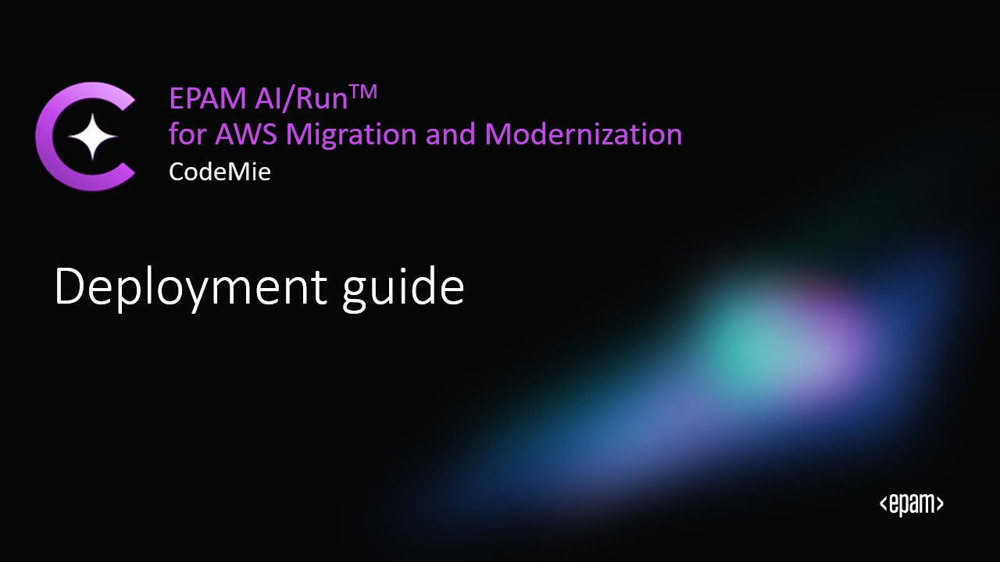](https://youtu.be/MelxbnkoWHo)

## 1.1. How to Use This Guide

For successful deployment, please follow these steps in sequence:
1. First, verify all prerequisites and set up your AWS environment accordingly. Next, deploy the required infrastructure using Terraform.
2. Finally, deploy and configure the  EPAM AI/Run™ for AWS Migration and Modernization components on EKS cluster by installing Helm Charts.
3. Complete post-installation configuration.

Each installation step is designed to ensure a smooth deployment process. The guide is structured to walk you through
from initial setup to a fully functional EPAM AI/Run™ for AWS Migration and Modernization environment on AWS.

# 2. Prerequisites

Before installing EPAM AI/Run™ for AWS Migration and Modernization, carefully review the prerequisites and requirements.

## 2.1. AWS Account Access Requirements
✓ Active AWS Account with a preferred region for deployment.
✓ User or Role with programmatic access to AWS account with permissions to create and manage IAM Roles and Policy Documents.

> ⚠️
> **Do not use the AWS account root user for any deployment or operations!**

## 2.2. Domain Name
✓ Available wildcard DNS hosted zone in Route53.

EPAM AI/Run™ for AWS Migration and Modernization terraform modules will automatically create:
* DNS Records.
* TLS certificate through AWS Certificate Manager, which will be used later by the ALB and NLB.

## 2.3. External connections
✓ Verify that firewall rules, SG and NACLs of EKS cluster allow outbound access to:
*  EPAM AI/Run™ for AWS Migration and Modernization container registry: **valid-link-to-aws-ecr.dkr.ecr.us-east-1.amazonaws.com/epam-systems/codemie**.
* 3rd party container registries: quay.io, docker.io, registry.developer.zurich/data.com.
* Any service you're planning to use with EPAM AI/Run™ for AWS Migration and Modernization (for example, GitHub instance).

✓ Firewall on your integration service allow inbound traffic from the EPAM AI/Run™ for AWS Migration and Modernization NAT Gateway public IP address.

ℹ️ NAT Gateway public IP address will be known after EKS installation.

## 2.4. LLM Models
✓ Activated region in AWS where AWS Bedrock Models are available.

✓ Activated desired LLMs and embeddings models in AWS account (for example, Sonnet 3.5/3.7, AWS Titan 2.0).

> ℹ️  EPAM AI/Run™ for AWS Migration and Modernization can be deployed with mock LLM configurations initially. Real configurations can be provided later if client-side approvals require additional time.

> ⚠️ **Important**: EPAM AI/Run™ for AWS Migration and Modernization requires at least one configured chat model and one embedding model to function properly. Ensure these are set up before proceeding with creating assistants or data sources.

> ⚠️ **Important**: After September 29,  2025, models will be automatically enabled for you.

## 2.5. User Permissions and Admission Control Requirements for EKS

<details>
<summary>Please expand to review components and permissions:

✓ Admin EKS permissions with rights to create `namespaces`.

✓ Admission webhook allows creation of Kubernetes resources listed below (applicable when deploying onto an existing EKS cluster with enforced policies).

</summary>

| EPAM AI/Run™ for AWS Migration and Modernization Component | Kubernetes APIs | Description |
|-------------------------------|-----------------|-------------|
| ElasticSearch                 | `Pod[securityContext]` | InitContainer must run as root user to set system parameter `vm.max_map_count=262144` |
| All components                | `Pod[securityContext]` | All components require SecurityContext with `readOnlyRootFilesystem: false` for proper operation |

</details>

## 2.6. Deployer instance requirements
✓ The following software must be pre-installed and configured on the deployer laptop or VDI instance before beginning
the deployment process (if you're using Windows, avoid mixing WSL with a native Windows installation):

<details>
<summary>Please expand to review tools:</summary>

* [terraform](https://developer.hashicorp.com/terraform/tutorials/aws-get-started/install-cli) `v1.13.5`
* [kubectl](https://kubernetes.io/docs/tasks/tools/#kubectl)
* [helm](https://helm.sh/docs/intro/install/)  `v3.16.0+`
* [AWS CLI](https://docs.aws.amazon.com/cli/latest/userguide/getting-started-install.html)
* [docker](https://docs.docker.com/get-started/get-docker/)
* [htpasswd](https://httpd.apache.org/)

</details>

ℹ️ If you use Windows, please use linux shells such as Git Bash, WSL, etc

## 2.7. Active Subscription in AWS Marketplace.

Before you start deployment, please ensure that you have an active subscription to the EPAM AI/Run™ for AWS Migration and Modernization in the [AWS Marketplace](https://aws.amazon.com/marketplace/pp?sku=86jeke9oer4t5bdyryfgyya7h).
After subscription activation the links to AWS ECR with required images and helm charts will be visible for you. You need them for deployment. Also, you can choose the version of the product you install.
> **Replace the dummy resource link `valid-link-to-aws-ecr.dkr.ecr.us-east-1.amazonaws.com` and version `x.y.z` with correct ones in the commands and configuration files where necessary.**

# 3. EPAM AI/Run™ for AWS Migration and Modernization deployment architecture

The diagram below depicts the EPAM AI/Run™ for AWS Migration and Modernization infrastructure deployment in one region (AZ) of the AWS public cloud environment.


<details>
<summary>Expand this section for reviewing EKS cluster components</summary>
Container Resources Requirements

| Component           | Pods      | RAM   | vCPU |
|---------------------|-----------|-------|-----|
| CodeMie API         | 2         | 8Gi   | 4.0 |
| CodeMie UI          | 1         | 128Mi | 0.1 |
| Elasticsearch       | 2         | 16Gi  | 4.0 |
| Kibana              | 1         | 1Gi   | 1.0 |
| Mermaid-server      | 1         | 512Mi | 1.0 |
| MCP Connect         | 1         | 1Gi   | 0.5 |
| Fluentbit           | daemonset | 128Mi | 0.1 |

</details>

# 4. AWS Infrastructure Deployment
## 4.1. Overview

Skip if you have a ready EKS cluster with all required services (check the diagram above).
This section describes the process of deploying the EPAM AI/Run™ for AWS Migration and Modernization infrastructure within an AWS environment. Terraform is used to manage resources and configure services.

>⚠️ A crucial step involves using a registered domain name added to AWS Route 53, which allows Terraform to automatically create SSL/TLS certificates via AWS Certificate Manager. These certificates are essential for securing traffic handled by the Application Load Balancer (ALB) and Network Load Balancer (NLB).

There are two deployment options available. Use the script if you want an easier deployment flow. Use the manual option if you want to control Terraform resources and provide customization.

## 4.2. Set up Hosted zone

### 4.2.1. Open Hosted zone page

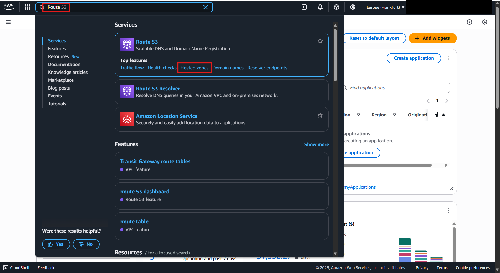

### 4.2.2. Click on Create hosted zone button

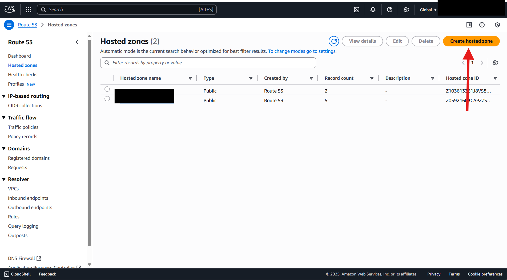

### 4.2.3. Create new hosted zone.
Create new hosted zone. Domain name should have the following pattern <any_name>.<your_DNS>.
<any_name> can be specific environment, for instance
``` dev.example.com ```

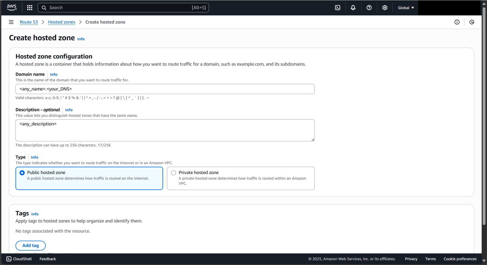

### 4.2.4. Locate NS servers values
Copy "Value/Route traffic to" value from NS record that was recently created.
Example of the NS record value:
```
ns-111.awsdns-00.net.
ns-121.awsdns-11.org.
ns-123.awsdns-22.com.
ns-1234.awsdns-33.co.uk.
```
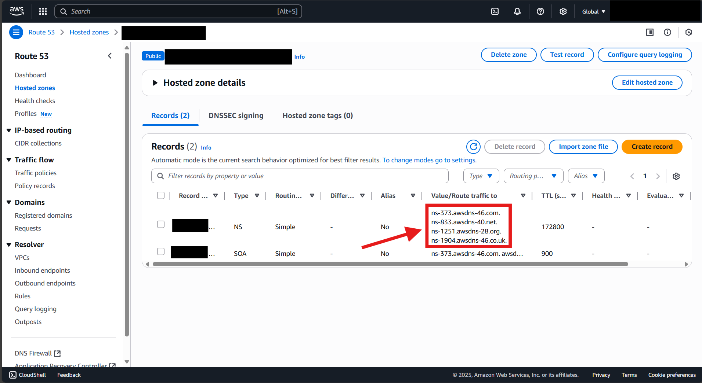

### 4.2.5. Adjust parent Hosted zone
Open parent hosted zone with name which equal to DNS name.
Create a new record in the hosted zone from the previous step
Record name - should be the same value as <any_name> from step 4.2.3 ``` dev.example.com ```
Record type - select "NS" option
Value - Paste the value from step 4.2.4

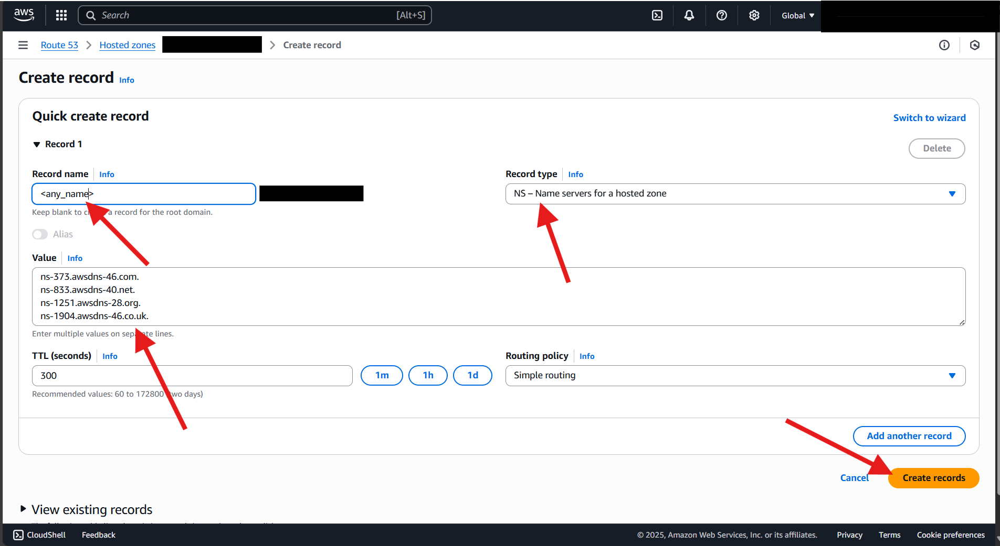

## 4.3. Set up credential for AWS

1. Find or create "credentials" file.
> By default, the file is located in the following directory:
    * "/Users/<user_name>/.aws" - Linux/Mac
    * "C:\Users\<profile>\.aws" - Windows

2. Open the file and update next property: aws_region, aws_access_key_id, aws_secret_access_key, aws_session_token (if you use temporary credential)

Also, you can use the command instead of the previous 2 steps

```bash
  aws configure
```
## 4.4. Clone repository

```bash
  git clone https://github.com/codemie-ai/codemie-aws-marketplace.git
  cd codemie-aws-marketplace/deployment/terraform-scripts
 ```

## 4.5. Infrastructure Provisioning

### 4.5.1. Automated: Installation Script

The `terraform.sh` script automates the deployment of infrastructure.

To deploy EPAM AI/Run™ for AWS Migration and Modernization infrastructure to AWS use the following steps:

1. Fill configuration details that specific for your AWS account in `deployment.conf`:
<details>
<summary>Expand this section for configuration details:</summary>

```bash
# AI/Run CodeMie deployment variables configuration
# Fill required values and save this file as deployment.conf

TF_VAR_region="<REGION>" # Example: us-east-1
TF_VAR_subnet_azs='[<SUBNET AZS>]' # Example: '["us-east-1a", "us-east-1b", "us-east-1c"]'

TF_VAR_platform_name="<PLATFORM NAME>" # Example: ai-run
TF_VAR_deployer_role_name="<ROLE>" # Example: AIRunDeployerRole. Ensure this is a new and unique name

TF_VAR_s3_states_bucket_name="<BUCKET NAME>" # Example: ai-run-terraform-states. Ensure this is a new and unique name following S3 naming rules.
TF_VAR_table_name="<TABLE NAME>" # Example: ai-run_terraform_locks. Ensure this is a new and unique name

TF_VAR_platform_domain_name="<DOMAIN NAME>" # Example: example.com.  The value should be taken from the Route 53 hosted zone created in the previous step.

TF_VAR_role_permissions_boundary_arn="" # Example: arn:aws:iam::012345678901:policy/role_boundary. Leave empty if you don't have a permissions boundary or don't want to use one.

# Uncomment in case Eks admin role is differ then current user
#TF_VAR_eks_admin_role_arn=""

TF_VAR_demand_instance_types='[{"instance_type":"m6a.2xlarge"}]'
TF_VAR_demand_max_nodes_count=4
TF_VAR_demand_desired_nodes_count=2
TF_VAR_demand_min_nodes_count=2

# RDS
TF_VAR_pg_instance_class="db.c6gd.medium"
```

</details>

2. Run installation script, possible flags:
   * `--access-key ACCESS_KEY`: Use the flag if the `.aws/credentials` file has not been updated.
   * `--secret-key SECRET_KEY`: Use the flag if the `.aws/credentials` file has not been updated.
   * `--region REGION`:         Use the flag if the `.aws/credentials` file has not been updated.
   * `--config-file FILE`:      Load configuration from file (default: deployment.conf)
   * `--help`

   The flags `--access-key`, `--secret-key`, and `--region REGION` can be omitted if step 4.3 has already been completed.

This bash script uses the default AWS profile for deploying the infrastructure. Ensure your default profile is properly configured with the necessary credentials and permissions before running the script.

3. Run the following command if using a Unix-like operating system:

```bash
  bash terraform.sh
```
or
```bash
  chmod +x terraform.sh
  ./terraform.sh
```

After execution, the script will:

1. Validate your deployment environment:
   a. Check for required tools (kubectl, AWS CLI, Terraform)
   b. Verify AWS authentication status
   c. Validate configuration parameters
2. Create IAM Deployer role with minimal policies
3. Deploy infrastructure:
   a. Create Terraform backend storage (S3 bucket)
   b. Deploy core EPAM AI/Run™ for AWS Migration and Modernization Platform infrastructure
   c. Set up necessary AWS resources
4. Generate Outputs and save them to `deployment_outputs.env` file containing essential infrastructure details, for example:

        ```
        AWS_DEFAULT_REGION=eu-west-2
        ECS_AWS_ROLE_ARN=arn:aws:iam::1234xxx:role/...
        AWS_KMS_KEY_ID=12345678-90ab-cdef-1234-567890abcdef
        AWS_S3_BUCKET_NAME=codemie-platform-bucket
        AWS_RDS_ENDPOINT=database.aaaaaaaaaaa.us-east-1.rds.amazonaws.com
        AWS_RDS_DATABASE_NAME=codemie
        AWS_RDS_DATABASE_USER=dbadmin
        AWS_RDS_DATABASE_PASSWORD=SomePassword
       ```

5. Deployment Completion:
   a. A success message will confirm the deployment
   b. Logs will be available in `codemie_aws_deployment_YYYY-MM-DD-HHMMSS.log`
   c. The script will display a summary of deployed resources including autogenerated superuser credentials 

⚠️ Keep the `deployment_outputs.env` file secure as it contains sensitive information. Do not commit it to version control.

After successful deployment, you can proceed with the EPAM AI/Run™ for AWS Migration and Modernization components
installation and start using EPAM AI/Run™ for AWS Migration and Modernization services.

⚠️ Important: after successful deployment the dedicated VPC in your AWS account is created in specified region with specified subnets' A-Zs.
VPC contains:
- route tables
- 1 public subnet with attached Internet gateway
- 1 private subnet with attached NAT gateway
- NACLs and SGs created by Terraform modules.
Please consider reviewing its configuration and adjust it according to your security policies.

⚠️ Important: during the deployment several secrets will be created in different namespaces for EKS cluster, only users with
proper permissions to EKS cluster can manage them: review, rotate, etc. There is no automated rotation implemented by default,
please consider implementing it after deployment https://aws.amazon.com/blogs/containers/aws-secrets-manager-controller-poc-an-eks-operator-for-automatic-rotation-of-secrets/.

### 4.5.2 Manual Deployment
If the previous step has already been completed, please proceed to skip this step.

<details>
<summary>If you prefer to manually deploy step by step, expand this section for more instructions:</summary>
### 4.6.1. Deployment Order

| # | Resource name      |
|---|--------------------|
| 1 | IAM deployer role  |
| 2 | Terraform Backend  |
| 3 | Terraform Platform |

### 4.6.2. IAM `Deployer` Role creation

This step covers the `DeployerRole` AWS IAM role creation.
The role contains minimum necessary permissions to deploy and manage the EPAM AI/Run™ for AWS infrastructure following
the policy of the least privilege access granted.

ℹ️ The created IAM role will be used for all subsequent infrastructure deployments and contains required permissions to manage AWS resources

To create the role, take the following steps:

1. Navigate to codemie-aws-iam folder:
   ```bash
   cd codemie-aws-iam
   ```
2. Review the input variables for Terraform in the `deployment/terraform-scripts/codemie-aws-iam/variables.tf` file and create a `<fileName>.tfvars` in the repo to change default variables values there in a format of key-value. For example:
   ```
   region = "your-region"
   role_arn = "arn:aws:iam::xxxx:role/DeployerRole"
   platform_domain_name = "your.domain"
   ```

⚠️ Ensure you have carefully reviewed all variables and replaced mock values with yours.

3. Initialize the backend and apply the changes:

```bash
  terraform init --var-file <fileName>.tfvars
  terraform plan --var-file <fileName>.tfvars
  terraform apply --var-file <fileName>.tfvars
```
### 4.6.3. Terraform backend resources deployment

This step covers the creation of:
* S3 bucket with policy to store terraform states

To create an S3 bucket for storing Terraform state files, follow the steps below:

1. Navigate to codemie-aws-remote-backend folder:
   ```bash
   cd ../codemie-aws-remote-backend
   ```
2. Review the input variables for Terraform in the `deployment/terraform-scripts/codemie-aws-remote-backend/variables.tf` file and create a `<filename>.tfvars` in the repo to change default variables values there in a format of key-value. For example:
 ```
   region = "your-region"
   role_arn = "arn:aws:iam::xxxxxxxx:role/AIRunDeployerRole" # The ARN of the IAM role that will be used for deployment. Note: This value becomes available after running the terraform apply command in Step 4.6.2.
   s3_states_bucket_name = "" # Example: ai-run-terraform-states. Ensure this is a new and unique name following S3 naming rules.
```
ℹ️ Ensure you have carefully reviewed all variables and replaced mock values with yours.

3.Initialize the backend and apply the changes:
```bash
  terraform init --var-file <fileName>.tfvars
  terraform plan --var-file <fileName>.tfvars
  terraform apply --var-file <fileName>.tfvars
```
The created S3 bucket will be used for all subsequent infrastructure deployments.

### 4.6.4. Terraform Platform

This step will cover the following topics:
* Create the EKS Cluster
* Create the AWS ASGs for the EKS Cluster
* Create the AWS ALB
* Create the AWS KMS key to encrypt and decrypt sensitive data in the AI/Run CodeMie application.
* Create the AWS IAM Role to access the AWS KMS and Bedrock services
* Create the AWS RDS PostgreSQL instance with database

To accomplish the tasks outlined above, follow these steps:

1. Navigate to codemie-aws-platform folder:
   ```bash
   cd ../codemie-aws-platform
   ```
2. Review the input variables for Terraform in the `deployment/terraform-scripts/codemie-aws-platform/variables.tf` file and create a `<filename>.tfvars` in the repo to manage custom variables there in a format of key-value. For example:
```
region                        = "<REGION>" # Example: us-east-1
role_arn                      = "arn:aws:iam::xxxxxxxx:role/AIRunDeployerRole" # The ARN of the IAM role that will be used for deployment. Note: This value becomes available after running the terraform apply command in Step 4.6.2.
platform_domain_name          = "<DOMAIN NAME>" # Example: example.com.  The value should be taken from the Route 53 hosted zone created in the previous
platform_name                 = "<Any Value>"
platform_cidr                 = "10.0.0.0/16"
subnet_azs = [<SUBNET AZS>] # Example: '["us-east-1a", "us-east-1b", "us-east-1c"]'
private_cidrs = ["10.0.0.0/22", "10.0.4.0/22", "10.0.8.0/22"]
public_cidrs = ["10.0.12.0/24", "10.0.13.0/24", "10.0.14.0/24"]
ssl_policy                    = "ELBSecurityPolicy-TLS-1-2-2017-01"
eks_admin_role_arn            =  "<eks_admin_role_arn>" # Specify the ARN of the IAM role with permissions to manage the EKS cluster.
add_userdata                  = ""
demand_instance_types = [{ instance_type = "m6a.2xlarge" }]
demand_max_nodes_count        = 4
demand_desired_nodes_count    = 2
demand_min_nodes_count        = 1
```
ℹ️ Ensure you have carefully reviewed all variables and replaced mock values with yours

3. Initialize the platform and apply the changes:
   The bucket_name and dynamodb_table_name values becomes available after running the terraform apply command in Step 4.6.2
```bash
  terraform init \
        -backend-config="bucket=<bucket_name>" \
        -backend-config="key=<aws_region>/codemie/platform_terraform.tfstate" \
        -backend-config="region=<aws_region>" \
        -backend-config="acl=bucket-owner-full-control" \
        -backend-config="use_lockfile=true" \
        -backend-config="encrypt=true" \
	--var-file <fileName>.tfvars
  terraform plan --var-file <fileName>.tfvars
  terraform apply --var-file <fileName>.tfvars
```
</details>

# 5. AI Models Integration and Configuration

> 📋 **Model Information**:
> 1. [Find the supported model IDs (deployment_name) in the AWS Bedrock documentation](https://docs.aws.amazon.com/bedrock/latest/userguide/models-supported.html)
> 2. [Find cost information for AWS Bedrock models](https://aws.amazon.com/bedrock/pricing/)

Example of providing LLM and embedding models for the custom environment:

1. Go to the `deployment/helm-scripts/codemie-api/values.yaml` file
2. Fill the following values to create and mount custom configmap to AI/Run pod:

<details>
<summary>Expand this section for configuration details:</summary>

```yaml
  extraObjects:
     - apiVersion: v1
       kind: ConfigMap
       metadata:
          name: codemie-llm-customer-config
       data:
          llm-amnaairn-config.yaml: |
             llm_models:
               - base_name: "amazon-nova-pro"
                 deployment_name: "eu.amazon.nova-pro-v1:0"
                 label: "Bedrock Nova Pro"
                 multimodal: true
                 enabled: true
                 default: true
                 provider: "aws_bedrock"
                 max_output_tokens: 10000
                 cost:
                   input: 0.00000105
                   output: 0.0000002625

             #  - base_name: "amazon-nova-lite"
             #    deployment_name: "eu.amazon.nova-lite-v1:0"
             #    label: "Bedrock Nova Lite"
             #    multimodal: true
             #    enabled: true
             #    provider: "aws_bedrock"
             #    max_output_tokens: 10000
             #    cost:
             #      input: 0.000000078
             #      output: 0.0000000195

             #  - base_name: "amazon-nova-micro"
             #    deployment_name: "eu.amazon.nova-micro-v1:0"
             #    label: "Bedrock Nova Micro"
             #    multimodal: false
             #    enabled: true
             #    provider: "aws_bedrock"
             #    max_output_tokens: 10000
             #    cost:
             #      input: 0.000000046
             #      output: 0.0000000115

             embeddings_models:
               - base_name: "titan"
                 deployment_name: "amazon.titan-embed-text-v1"
                 label: "Titan Embeddings G1 - Text"
                 enabled: true
                 default: true
                 provider: "aws_bedrock"
                 cost:
                   input: 0.0000001
                   output: 0
```
</details>

# 6. EPAM AI/Run™ for AWS Migration and Modernization Components Deployment

## 6.1. Overview

This section describes the process of the main EPAM AI/Run™ for AWS Migration and Modernization components deployment to the AWS EKS cluster.

### 6.1.1. Core AI/Run CodeMie Components:

ℹ️ EPAM AI/Run™ for AWS Migration and Modernization current versions of artifacts: **2.41.0-oss**

<details>
<summary> Expand the section to review all required AI/Run components:</summary>

| Component name | Images | Description |
|---------------|--------|-------------|
| AI/Run CodeMie API | valid-link-to-aws-ecr.dkr.ecr.us-east-1.amazonaws.com/epam-systems/codemie | The backend service of the EPAM AI/Run™ for AWS Migration and Modernization application responsible for business logic, data processing, and API operations |
| AI/Run CodeMie UI | valid-link-to-aws-ecr.dkr.ecr.us-east-1.amazonaws.com/epam-systems/codemie-ui | The frontend service of the EPAM AI/Run™ for AWS Migration and Modernization application that provides the user interface for interacting with the system |
| AI/Run CodeMie MCP Connect | valid-link-to-aws-ecr.dkr.ecr.us-east-1.amazonaws.com/epam-systems/codemie-mcp-connect-service | A lightweight bridge tool that enables cloud-based AI services to communicate with local Model Content Protocol (MCP) servers via protocol translation while maintaining security and flexibility |
| AI/Run Mermaid Server | valid-link-to-aws-ecr.dkr.ecr.us-east-1.amazonaws.com/epam-systems/mermaid-server | Implementation of open-source service that generates image URLs for diagrams based on the provided Mermaid code for workflow visualization |

</details>

### 6.1.2. Required Third-Party Components:

<details>
<summary> Expand the section to review all required 3d party components:</summary>

| Component name | Images | Description |
|---------------|--------|-------------|
| Ingress Nginx Controller | registry.k8s.io/ingress-nginx/controller:x.y.z | Handles external traffic routing to services within the Kubernetes cluster. The EPAM AI/Run™ for AWS Migration and Modernization application uses oauth2-proxy, which relies on the Ingress Nginx Controller for proper routing and access control |
| Storage Class | - | Provides persistent storage capabilities |
| Elasticsearch |   docker.elastic.co/elasticsearch/elasticsearch:x.y.z | Database component that stores all EPAM AI/Run™ for AWS Migration and Modernization data, including datasources, projects, and other application information |
| Kibana | docker.elastic.co/kibana/kibana:x.y.z | Web-based analytics and visualization platform that provides visualization of the data stored in Elasticsearch. Allows monitoring and analyzing EPAM AI/Run™ for AWS Migration and Modernization data |
| FluentBit | cr.fluentbit.io/fluent/fluent-bit:x.y.z | FluentBit enables logs and metrics collection from EPAM AI/Run™ for AWS Migration and Modernization enabling the agents observability |

</details>

## 6.2. Scripted Components Installation

1. Navigate helm-scripts folder:
   ```bash
   cd ../helm-scripts

2. Run the following command if using a Unix-like operating system:
   ```bash
   chmod +x helm-charts.sh

3. Run deployment script:

```bash
  bash ./helm-charts.sh --version=2.41.0
```
```bash
  ./helm-charts.sh --version=2.41.0
```

To see all possible flags run script with `--help` flag set.

⚠️ **Important**: If you update ConfigMaps either manually or through a Helm upgrade, you must restart the affected pods to apply the changes. Neither manual updates nor Helm upgrades automatically restart pods, so any changes to ConfigMaps will not take effect until the pods are restarted.

## 6.3. Manual Components Installation
If the previous step has already been completed, please proceed to skip this step.

<details>

<summary>If you prefer to manually deploy step by step, expand this section for more instructions:</summary>

### 6.3.1. Set up kubectl config and login in to ECR
Run next command

```bash
  aws eks update-kubeconfig --region <REGION> --name <PLATFORM_NAME>
  aws ecr get-login-password --region us-east-1 | helm registry login --username AWS --password-stdin 709825985650.dkr.ecr.us-east-1.amazonaws.com/epam-systems
```

### 6.3.2. Nginx Ingress controller

Install only in case if your EKS cluster does not have Nginx Ingress Controller.

1. Create Kubernetes namespace e.g. `ingress-nginx` with the command:

```bash
   kubectl create namespace ingress-nginx
```
2. Navigate helm-scripts folder
```bash
  cd ../helm-scripts
```
3. Install ingress-nginx helm chart in created namespace:
```bash
   helm upgrade --install ingress-nginx ingress-nginx/. -n ingress-nginx --values ingress-nginx/values.yaml --wait --timeout 900s --dependency-update
```
### 6.3.3. AWS gp3 storage class:

Install only in case if your EKS cluster does not have AWS gp3 storage class:

```bash
  kubectl apply -f storage-class/storageclass-aws-gp3.yaml
```
### 6.3.4. Install Elasticsearch component:

1. Create Kubernetes namespace, e.g. `elastic` with the command:

   ```bash
   kubectl create namespace elastic
   ```
   
2. Create Kubernetes secret:

``` bash
   kubectl -n elastic create secret generic elasticsearch-master-credentials \
   --from-literal=username=elastic \
   --from-literal=password="$(openssl rand -base64 12 | tr -d '/+=')" \
   --type=Opaque \
   --dry-run=client -o yaml | kubectl apply -f -
```

Secret example:

```
   apiVersion: v1
   kind: Secret
   metadata:
      name: elasticsearch-master-credentials
   type: Opaque
   data:
      username: <base64-encoded-username>
      password: <base64-encoded-password>
```

3. Install elasticsearch helm chart in created namespace with the command:

``` bash
   helm upgrade --install elastic elasticsearch/. -n elastic --values elasticsearch/values.yaml --wait --timeout 900s --dependency-update
```

### 6.3.5. Install Kibana component:

1. Replace `%%DOMAIN%%` with your domain name (e.g. `example.com`) in `kibana/values.yaml` file.
   The value should be taken from the Route 53 hosted zone that was created during an earlier step of this guide or from variable `CODEMIE_DOMAIN_NAME` in the `deployment_outputs.env` file.

2. Install `kibana` helm chart with the command:

   ```bash
   helm upgrade --install kibana kibana/. -n elastic --values kibana/values.yaml --wait --timeout 600s --dependency-update
   ```
   
3. Kibana can be accessed by the following URL: https://kibana.%%DOMAIN%%, e.g https://kibana.example.com

### 6.3.6. Install Fluentbit component

If you do not have your own logging system then consider installing Fluentbit component to store historical log data.

1. Create `fluentbit` namespace:

```bash
  kubectl create ns fluentbit
```

2. Copy Elasticsearch credentials to the fluentbit namespace with the command:
```bash
  kubectl get secret elasticsearch-master-credentials -n elastic -o yaml | sed '/namespace:/d' | kubectl apply -n fluentbit -f -
```

3. Create config map with name `config`, take the value of `AWS_DEFAULT_REGION` from `deployment_outputs.env` file:

```bash
  kubectl -n fluentbit create configmap "config" \
    --from-literal=AWS_REGION="$AWS_DEFAULT_REGION"
```

4. Install fluentbit with the command:
```bash
  helm upgrade --install fluent-bit fluent-bit/. -n fluentbit --values fluent-bit/values.yaml --wait --timeout 900s --dependency-update
```

</details>

### 6.3.7. Install AI/Run CodeMie MCP Connect component:

To deploy MCP Connect service, execute the following script replacing exported values by your custom if needed:

```bash
export IMAGE_REPOSITORY="709825985650.dkr.ecr.us-east-1.amazonaws.com/epam-systems/codemie-mcp-connect-service"
export HELM_REPOSITORY="oci://$IMAGE_REPOSITORY"
export CODEMIE_VERSION="2.41.0"

helm upgrade --install codemie-mcp-connect-service "$HELM_REPOSITORY" \
    --version "${CODEMIE_VERSION}" \
    --namespace "codemie" \
    --set "image.repository=$IMAGE_REPOSITORY" \
    --set "image.tag=$CODEMIE_VERSION-oss" \
    --wait \
    --timeout 600s \
    --dependency-update
```

### 6.3.8. Install AI/Run Mermaid Server component:

To deploy Mermaid Server component, execute the following script replacing exported values by your custom if needed:

```bash
export IMAGE_REPOSITORY="709825985650.dkr.ecr.us-east-1.amazonaws.com/epam-systems/mermaid-server"
export HELM_REPOSITORY="oci://$IMAGE_REPOSITORY"
export CODEMIE_VERSION="2.41.0"

helm upgrade --install mermaid-server "$HELM_REPOSITORY" \
    --version "${CODEMIE_VERSION}" \
    --namespace "codemie" \
    --set "image.repository=$IMAGE_REPOSITORY" \
    --set "image.tag=$CODEMIE_VERSION-oss" \
    -f "./mermaid-server/values.yaml" \
    --wait \
    --timeout 600s \
    --dependency-update
```

### 6.3.9. Install AI/Run CodeMie UI component:

To deploy CodeMie UI component, execute the following script replacing exported values by your custom if needed:

```bash
export IMAGE_REPOSITORY="709825985650.dkr.ecr.us-east-1.amazonaws.com/epam-systems/codemie-ui"
export HELM_REPOSITORY="oci://$IMAGE_REPOSITORY"
export CODEMIE_VERSION="2.41.0"
export CODEMIE_DOMAIN=$CODEMIE_DOMAIN_NAME  # Taken from `deployment_outputs.env` file

helm upgrade --install codemie-ui "$HELM_REPOSITORY" \
    --version "${CODEMIE_VERSION}" \
    --namespace "codemie" \
    -f "./codemie-ui/values.yaml" \
    --set "image.repository=$IMAGE_REPOSITORY" \
    --set "image.tag=$CODEMIE_VERSION-oss" \
    --set "viteApiUrl=https://codemie.$CODEMIE_DOMAIN/code-assistant-api" \
    --set "ingress.host=codemie.$CODEMIE_DOMAIN" \
    --wait \
    --timeout 600s \
    --dependency-update
```

### 6.3.10. Install AI/Run CodeMie API component:

1. Create secret with PostgreSQL properties taking actual values from `deployment_outputs.env` file:

```bash
   kubectl -n codemie create secret generic "codemie-postgresql" \
      --from-literal=password="${AWS_RDS_DATABASE_PASSWORD}" \
      --from-literal=user="${AWS_RDS_DATABASE_USER}" \
      --from-literal=db-url="${AWS_RDS_ADDRESS}" \
      --from-literal=db-name="${AWS_RDS_DATABASE_NAME}"
```

2. Create config map with generic properties taking actual values from `deployment_outputs.env` file:

```bash
  kubectl -n "$namespace" create configmap "codemie-config" \
      --from-literal=AWS_DEFAULT_REGION="$AWS_DEFAULT_REGION" \
      --from-literal=AWS_KMS_KEY_ID="$AWS_KMS_KEY_ID" \
      --from-literal=AWS_S3_BUCKET_NAME="$AWS_S3_BUCKET_NAME" \
      --from-literal=AWS_S3_REGION="$AWS_S3_BUCKET_REGION" \
      --from-literal=CODEMIE_DOMAIN_NAME="$CODEMIE_DOMAIN_NAME" 
```

3. Create secret with access properties:

```bash
  private_key=$(openssl genpkey -algorithm RSA -pkeyopt rsa_keygen_bits:2048)
  public_key=$(echo "$private_key" | openssl rsa -pubout)
  
  kubectl -n "$namespace" create secret generic "codemie-access" \
      --from-literal=email="admin@codemie.ai" \
      --from-literal=password="$(openssl rand -base64 18)" \
      --from-literal=jwt_private.pem="$private_key" \
      --from-literal=jwt_public.pem="$public_key" \
      --type=Opaque
```

4. Copy Elasticsearch credentials to the application namespace with the command:

```bash
  kubectl get secret "$secret_name" -n elastic -o yaml | \
     sed '/namespace:/d' | \
     sed '/creationTimestamp:/d' | \
     sed '/resourceVersion:/d' | \
     sed '/uid:/d' | \
     kubectl apply -n "$namespace" -f -
```

5. Patch copied secret to establish certificate trust:

```bash
ca_subject_hash=$(kubectl -n codemie get secret "elasticsearch-master-certs" -o jsonpath='{.data.ca\.crt}' | base64 -d | openssl x509 -noout -subject_hash)
kubectl -n codemie patch secret elasticsearch-master-certs -p "{\"stringData\":{\"ca.hash\":\"$ca_subject_hash\"}}"
```

6. Install codemie-api helm chart, applying custom values file with the command:

```bash
  helm upgrade --install codemie-api codemie-api/. \
  --version 2.26.1 \
  --namespace "codemie" \
  -f "./codemie-api/values.yaml"  \
  --wait --timeout 600s \
  --dependency-update
```

7. AI/Run CodeMie UI can be accessed by the following URL: https://codemie.%%DOMAIN%% , e.g. https://codemie.example.com

# 7. Provide access to the application

## 7.1. Create new security group
### 7.1.1. Open EC2 service group

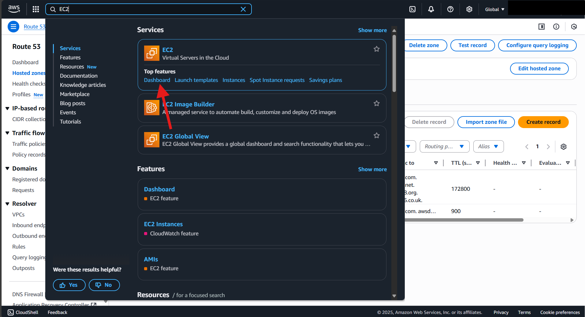

### 7.1.2. Open "Security Groups"

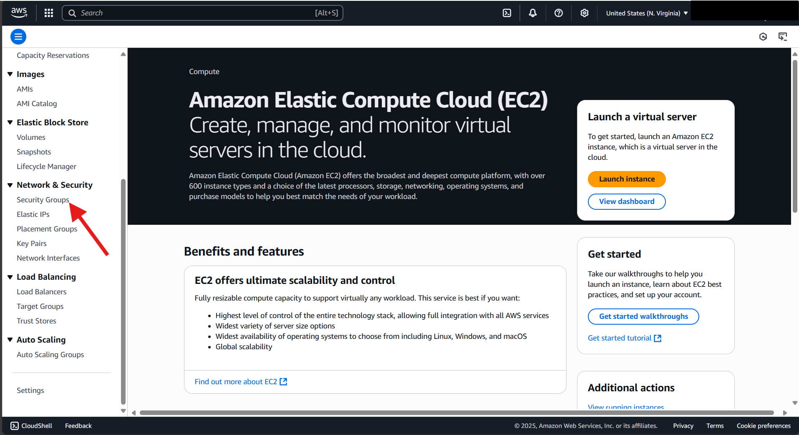

### 7.1.3. Create new "Security Groups"

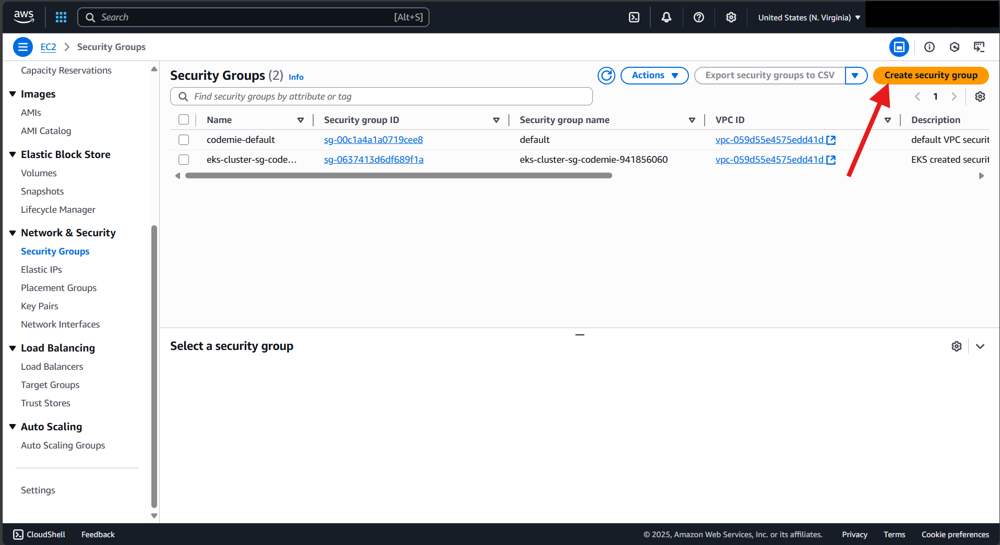

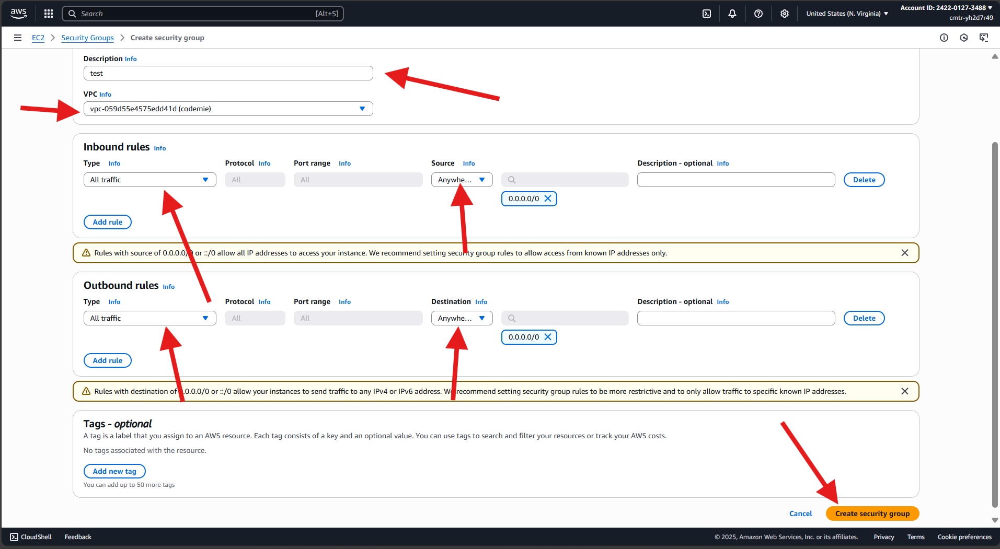

## 7.2. Add security group to Load Balancers
### 7.2.1. Open  Load Balancers

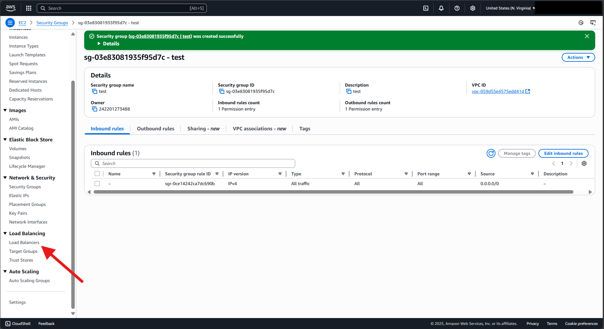

### 7.2.2. Find and open  <some name>-ingress-alb balancer to cluster which was created


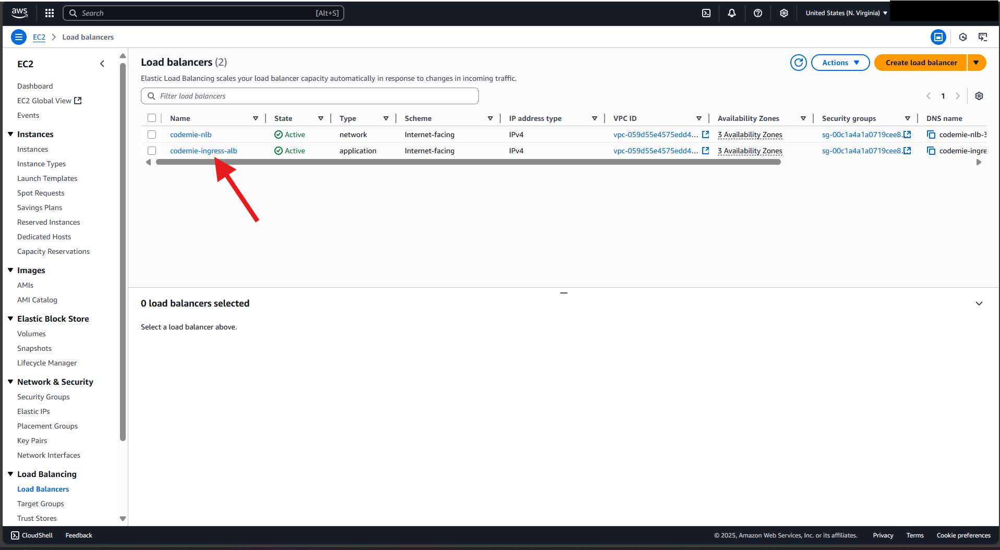

### 7.2.3. Navigate to security tab and click "edit" button

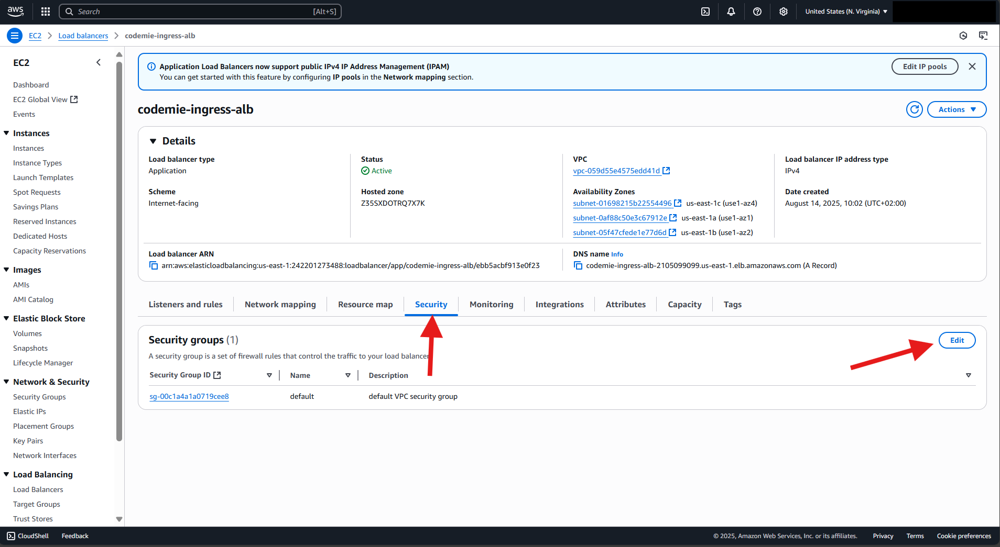

### 7.2.4. Add new security group and save changes

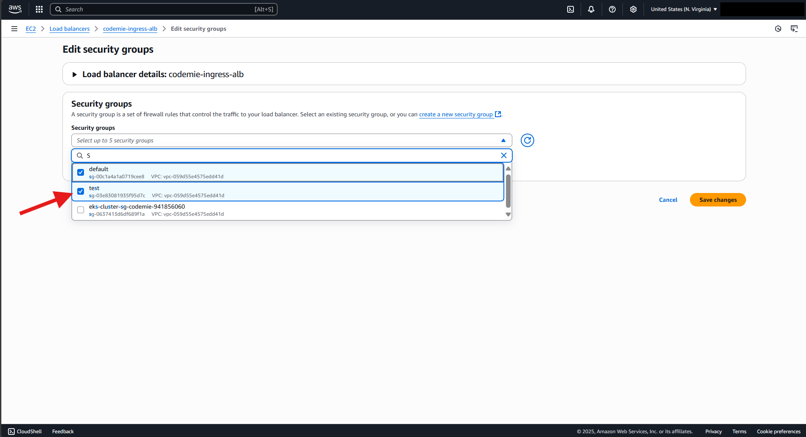

# 8. User Management

## 8.1. Super Admin User

A super admin user is automatically created by the `helm-charts.sh` script during components deployment. The credentials (username and password) are printed to stdout on each execution of the script. Retrieve them from the deployment output or from the script logs.

## 8.2. Onboarding Additional Users

To create additional users, they must self-register through the application's registration form available at the login page. Any user who registers this way is granted limited privileges by default — they have access only to their personal project and cannot manage platform-wide settings or other users' resources.

To manage project access for additional users, refer to the [User Management](https://docs.codemie.ai/user-guide/project-user-management/users/) documentation.

# 9. Cost Management

Please carefully review all billable services (depicted on deployment diagram) and their pricing [here](https://aws.amazon.com/pricing/).
The product listed on AWS Marketplace is free, but usage incurs costs associated with the AWS services it utilizes. It is recommended to review the pricing details of these services to understand potential costs.

# 10. Monitoring and Recovery

EPAM AI/Run™ for AWS Migration and Modernization application uses built-in AWS services monitoring and alerting
capabilities.
All logs are aggregated and published into AWS CloudWatch, categorized based on their importance:
``
   "*-important"
   "*-verbose"
``
Please consider setup alerts after the deployment.
By default, EBS snapshots are enabled for ``*-on-demand-*`` EBS volumes. You can disable this functionality after deployment.

The user data is stored in AWS RDS, EBS, and AWS S3 services. You can use launch templates "worker_group_on_demand-*" created during deployment to restore the environment in case of failure.
More information about potential [issues](https://docs.aws.amazon.com/eks/latest/userguide/troubleshooting.html).

# 11. Maintenance
This guide relies on valid AWS credentials with sufficient permissions to create and manage resources.
Users are responsible for keeping their credentials secure and up to date. We strongly recommend enabling credential rotation
for enhanced security. Refer to the AWS documentation on credential rotation: [Rotate Your Secrets with AWS Secrets Manager](https://docs.aws.amazon.com/secretsmanager/latest/userguide/rotate-secrets_turn-on-cli.html)

The container images used in this deployment are regularly scanned for vulnerabilities. In the event of a critical vulnerability, users are responsible for updating the images in their AWS ECR repository to the latest product version and redeploying the application with the updated images. For detailed guidance, see:
[Amazon ECR Image Scanning Documentation](https://docs.aws.amazon.com/AmazonECR/latest/userguide/image-scanning.html).

The compute infrastructure for the EKS cluster is based on self-managed node groups configured with Auto Scaling Groups using a Target Tracking Scaling Policy. Users may customize the default behavior to suit their specific scaling needs. More details are available here:
[Cluster Autoscaler for Amazon EKS](https://docs.aws.amazon.com/eks/latest/userguide/cluster-autoscaler.html).

The EC2 instances for the node groups use the AWS AMI version amazon-eks-node-al2023-x86_64-standard-1.33-v20250715. To ensure ongoing security, consider using AWS Systems Manager's Session Manager to enable automatic patching for AMIs. Learn more through the following documentation:
[AWS Systems Manager Patch Manager](https://docs.aws.amazon.com/systems-manager/latest/userguide/patch-manager.html).


# 12. Support
This is a version for educational exploration, provided free of charge, relying on community-based assistance.
For deploying enterprise-grade versions and professional help with building custom-tailored AI solutions,
contact EPAM Systems - SupportAIRunforAWS@epam.com or [EPAM Systems Contacts](https://www.epam.com/services/artificial-intelligence/epam-ai-run-tm#contact).
